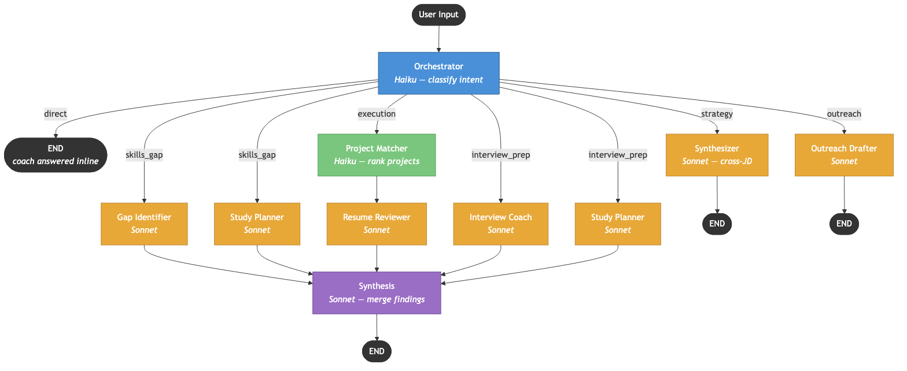

# CareerCoach — LangGraph Project Report

## Overview

CareerCoach is a **Streamlit-based career coaching application** powered by a **LangGraph multi-agent system** that orchestrates specialized Claude-based agents for job seekers. It uses `StateGraph` from LangGraph to route user queries through an intelligent pipeline of 9 nodes, with optimizations for cost efficiency and output quality.

---

## Tech Stack

| Layer | Technology |
|-------|-----------|
| UI | Streamlit |
| Orchestration | LangGraph 0.2+ (`StateGraph`) |
| LLM | Claude Sonnet 4.5 (agents), Claude Haiku 4.5 (routing/ranking) |
| Persistence | SQLite (`SqliteSaver` checkpointer) |
| Extras | Google Calendar OAuth, PDF/DOCX parsing |

---

## Graph Architecture

The core lives in `graph/`:

```
graph/
├── state.py           — CareerOSState TypedDict (shared state schema)
├── graph.py           — StateGraph assembly + invoke_coach_graph()
├── nodes.py           — 9 node implementations
├── utils.py           — Claude API wrapper, DB helpers
└── project_matcher.py — Keyword + domain-cluster + LLM-based project ranking
```

### State Schema (`graph/state.py`)

`CareerOSState` is a `TypedDict` with fields for:
- **Inputs**: `user_message`, `profile`, `jobs`, `projects`, `calendar_connected`
- **Agent findings**: `gap_findings`, `weak_areas`, `resume_suggestions`, `matched_projects`, `study_plan`
- **Caching**: `resume_cache` — stores generated resume bullets keyed by job ID + JD hash, preventing redundant LLM calls when the JD hasn't changed
- **Routing**: `coach_diagnosis` (drives conditional edges)
- **Messages**: `Annotated[list, operator.add]` — accumulates across all nodes automatically

### Graph Topology (`graph/graph.py`)



**Routing logic** (`route_after_diagnosis`): The orchestrator classifies user intent into 6 categories, then conditionally routes:

| Diagnosis | Path |
|-----------|------|
| `direct` | END (answered inline) |
| `skills_gap` | gap + study (parallel) → synthesis |
| `execution` | project_matcher → resume → synthesis |
| `interview_prep` | interview → study (sequential) → synthesis |
| `strategy` | synthesizer → END |
| `outreach` | outreach → END |

### Nodes (`graph/nodes.py`)

| Node | Model | Purpose |
|------|-------|---------|
| **orchestrator** | Keyword bypass / Haiku fallback | Intent classification; answers simple queries directly |
| **gap** | Sonnet | Fit analysis with score, critical/closeable gaps |
| **resume** | Sonnet | Bullet rewriting grounded in project library (with caching) |
| **interview** | Sonnet | Mock interviews; extracts `weak_areas` via regex |
| **study** | Sonnet | Study plan prioritizing weak areas from interview |
| **project_matcher** | Haiku (if >8 projects) | Ranks projects by JD relevance |
| **outreach** | Sonnet | LinkedIn/cold email drafting |
| **synthesizer** | Sonnet | Cross-JD pattern analysis |
| **synthesis** | Sonnet | Merges multi-agent findings; skipped when only 1 sub-agent ran |

### Cross-Agent Data Flow

Key design pattern: nodes write findings to shared state fields, downstream nodes read them.

- **Interview → Study** (sequential): `weak_areas` list flows from interview node to study node, prioritizing the study plan around confirmed weaknesses. These run sequentially (not in parallel) so study always has fresh interview findings.
- **ProjectMatcher → Resume**: `project_ctx` (matched projects) flows sequentially to resume node for grounded bullet rewriting
- **Multi-agent → Synthesis**: `gap_findings`, `resume_suggestions`, `study_plan` are injected into the final synthesis prompt. When only one sub-agent produced output, synthesis is skipped to save tokens — the sub-agent's response is returned directly.

### Persistence

Uses `SqliteSaver` checkpointer on `careeros.db` with a fixed thread ID (`"careeros_coach"`), enabling cross-session state persistence.

---

## Cost Optimization

The system is designed to maximize output quality under tight API budget constraints:

### Model Strategy
- **Sonnet 4.5** for all reasoning agents — 5× cheaper than Opus with strong quality for resume writing, coaching, and interview prep
- **Haiku 4.5** for classification and project ranking — fast and cheap

### Token Reduction
| Optimization | Mechanism | Savings |
|---|---|---|
| **Keyword intent bypass** | Regex-matches obvious intents ("rewrite resume", "mock interview") to skip the Haiku classification call entirely | ~1 Haiku call per obvious request |
| **Conversation sliding window** | Caps API input to last 10 messages instead of full history | ~40-60% input tokens for long conversations |
| **Synthesis skip** | When only 1 sub-agent ran (e.g., resume-only), skips the redundant synthesis LLM call | 1 full Sonnet call saved per single-agent route |
| **Resume caching** | Caches generated bullets per job ID + JD hash; returns cached result if JD unchanged | $0 for repeat views |
| **Tuned max_tokens** | Gap (1200), Study (1200), Outreach (1000), Synthesis (1600) — reduced from 2000-2400 defaults | Fewer output tokens per call |

---

## Project Matcher (`graph/project_matcher.py`)

Two-tier matching system that selects the most relevant projects from the Project Library for each JD:

### Tier 1: Keyword + Domain-Cluster Scoring (≤8 projects)
- **Token overlap**: 2 pts per shared tech keyword (`pytorch`, `docker`, `fastapi`, etc.), 1 pt per shared ordinary token (min 4 chars)
- **Domain cluster expansion**: If a JD mentions any word in a domain cluster, all related words become virtual JD tokens. Clusters:
  - Distributed systems: `raft`, `consensus`, `replication` ↔ `backend`, `infrastructure`, `scalable`, `microservices`
  - ML/AI: `training`, `inference`, `embeddings` ↔ `deep-learning`, `neural`, `classifier`
  - DevOps: `docker`, `kubernetes`, `terraform` ↔ `deployment`, `cloud`, `containerized`
  - Frontend: `react`, `typescript`, `nextjs` ↔ `ui`, `web`, `full-stack`
  - Mobile: `swift`, `swiftui`, `ios` ↔ `app`, `mobile`, `native`
- **Normalized** by `token_count^0.3` to avoid length bias
- Returns top 5 ranked projects

### Tier 2: LLM Semantic Ranking (>8 projects)
- Uses Haiku to semantically rank projects considering technology overlap, domain relevance, and company industry
- Falls back to keyword matching if LLM call fails

---

## UX Optimizations

### Auto-Start Agents
When the Resume Reviewer or Interview Coach opens with an empty chat and a job selected, the agent automatically begins working — no need to type or click a starter prompt.
- Resume: auto-sends "Rewrite my bullets for this role — give me copy-paste ready output"
- Interview: auto-sends "Run a full mock interview for this role. Start with the most likely question types."

### Quick Refinement Buttons
After every agent response, one-click follow-up buttons appear for the most common refinements:

| Agent | Quick Actions |
|-------|---------------|
| Resume | Add more metrics, Make bullets more concise, Focus on projects, Rewrite Skills, Full analysis |
| Interview | Next question, Harder question, Switch to behavioral/technical, Give feedback |
| Gap | What to study first?, Address gaps in cover letter? |
| Study | 1-week crash plan, Add practice problems, Must-know only |

---

## Prompts (`prompts.py`)

8 parameterized prompt builders via `build_system_prompt(agent, ...)`. Each is heavily engineered — e.g., the resume agent enforces bullet formulas (`[verb] + [what] + [how/tech] + [outcome with number]`), the interview agent stays in character as a company-specific interviewer, and the study agent builds schedules backward from deadlines.

---

## Notable Design Decisions

1. **Haiku for routing, Sonnet for reasoning** — fast + cheap classification, deep analysis only where needed
2. **Keyword bypass before LLM classification** — obvious intents like "rewrite resume" skip the Haiku call entirely, saving tokens
3. **Interview → Study runs sequentially** — study node needs `weak_areas` extracted by the interview node, so they cannot run in parallel
4. **Regex-based weak area extraction** — no extra LLM call to parse interview output
5. **Domain-cluster project matching** — keyword scoring enhanced with semantic domain clusters so a distributed systems project matches SWE JDs even without exact keyword overlap
6. **Synthesis is conditional** — only runs when 2+ sub-agents produced findings; single-agent routes return directly
7. **Sliding window on conversation history** — caps at 10 messages to prevent unbounded input token growth
8. **Resume caching** — same JD + same job = cached output, no redundant API call
9. **Zero Streamlit imports in graph/** — clean separation enables future migration to other frameworks

---

## Entry Point

The app runs via `streamlit run app.py`. The coach agent chat calls `invoke_coach_graph()` from `graph/graph.py`, which builds the state, invokes the compiled graph, extracts the final response, and returns updated career state back to the Streamlit session.
